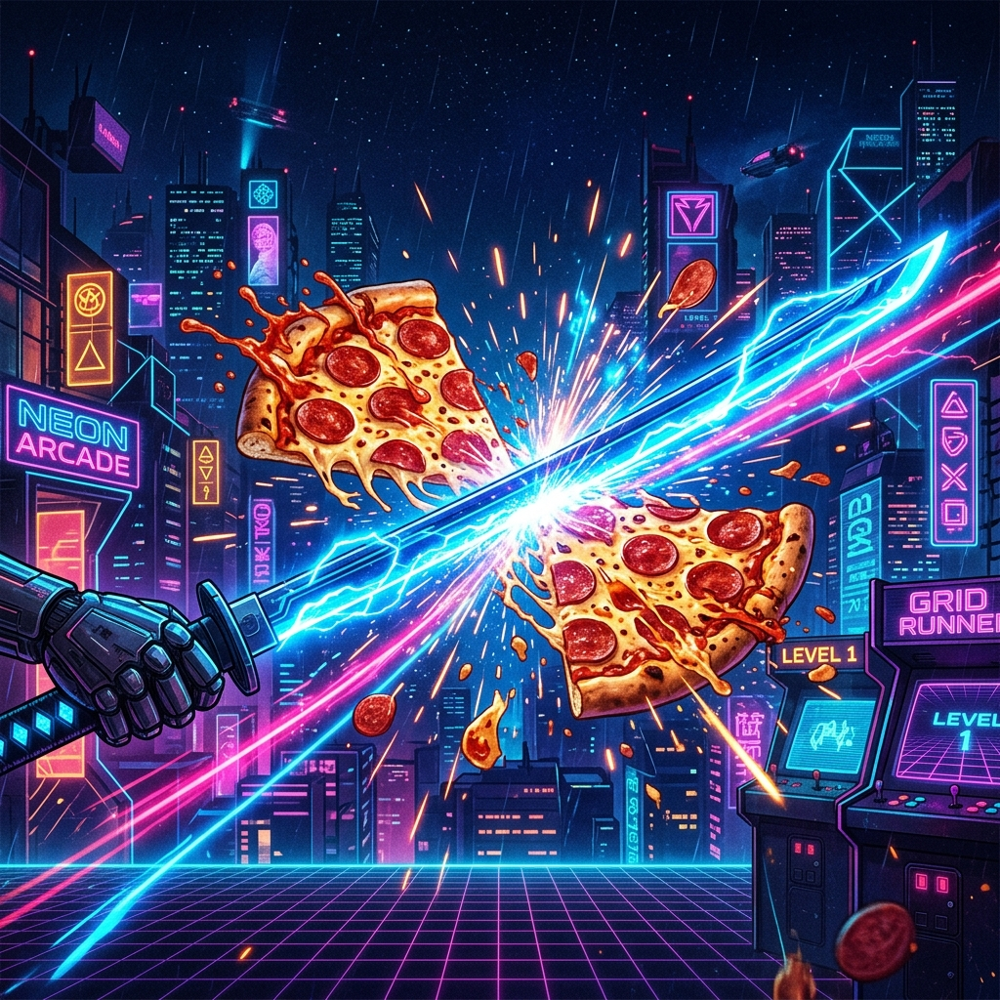
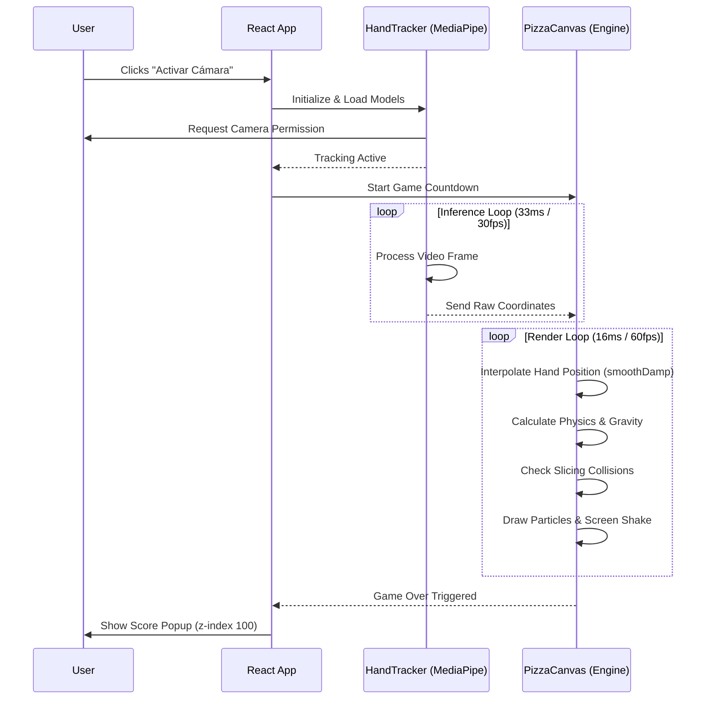

<div align="center">
  
  
  # 🍕 Slash Slice: Turtle Ninja Edition ⚔️
  
  **An AI-powered, 60fps, Web3-enabled pizza slashing game built with React, Go, and Soroban.**
  
  [Play Now (Vercel)](https://slashslice.spicycrust.com) | [Report Bug](#) | [Request Feature](#)
</div>

<br />

## 🌟 Overview

**Slash Slice: Turtle Ninja Edition** is a modern, high-performance web game inspired by arcade classics like Fruit Ninja. It utilizes **Google's MediaPipe** to allow players to use their bare hands via a webcam to slice pizzas on the screen in real-time. 

With a custom 60 FPS physics engine, mathematically rigorous spring-damper rendering, and Web3 integration for saving records directly to the **Stellar blockchain (Soroban)**, this game pushes the limits of what's possible in the browser.

---

## 🚀 Features

- **👐 AI Hand Tracking:** Play using your webcam. MediaPipe tracks your index finger to cast a glowing neon sword trail.
- **🖱️ Classic Mode:** Full support for mouse and mobile touch-screens.
- **⚡ 60 FPS Canvas Engine:** A custom requestAnimationFrame loop with `smoothDamp` interpolation ensures butter-smooth gameplay without destroying mobile CPUs.
- **🛡️ Web3 Wallet Integration:** Connect your **Freighter Wallet** to immortalize your high scores securely on the Stellar blockchain.
- **🎵 Dynamic Audio Context:** Immersive synthwave/Italian cooking ambient drones generated natively via Web Audio API.
- **🎨 AAA Aesthetics:** Glassmorphism UI, custom pixel fonts (Lilita One, VT323), and satisfying hit-stop screen shake.

---

## 🛠️ Technology Stack

* **Frontend:** React 18, Vite, TypeScript, Tailwind CSS, Framer Motion, Lucide React
* **AI Vision:** MediaPipe Hands (Lite Model @ 30fps capped for main-thread freedom)
* **Backend:** Go (WebSockets server) *(Pending Integration / Active Dev)*
* **Web3/Blockchain:** Soroban (Stellar Network), Freighter Wallet API

---

## 📐 Architecture & Workflows

### 1. High-Level System Architecture
This diagram illustrates how the Computer Vision AI, the 60FPS Game Engine, and the Web3 integration connect.

```mermaid
graph TD
    subgraph Frontend ["React + Vite App (Frontend)"]
        UI["UI Components & Menus"]
        Canvas["PizzaCanvas Engine (60 FPS)"]
    end
    
    subgraph AI ["Computer Vision"]
        Webcam("Webcam Stream")
        MediaPipe["MediaPipe Hands (30 FPS Cap)"]
    end
    
    subgraph Web3 ["Stellar Blockchain"]
        Freighter("Freighter Wallet")
        Soroban["Soroban Smart Contracts"]
    end

    Webcam -->|Video Frames| MediaPipe
    MediaPipe -->|X/Y Coordinates (EMA Smoothed)| Canvas
    Canvas -->|Score & Duration Data| UI
    UI -->|Connect & Sign| Freighter
    Freighter -->|Submit Record On-Chain| Soroban
```

### 2. Game Loop & Performance Flow
A sequence of how the user interacts with the app, ensuring the main thread is never blocked.



---

## 💻 Running Locally

### Prerequisites
* Node.js (v18+ recommended)
* Go (1.20+) *(Optional for backend features)*
* A webcam (Required for Camera mode)

### Installation

1. **Clone the repository:**
   ```bash
   git clone https://github.com/CaBsCrypto/pizzaninja.git
   cd pizzaninja
   ```

2. **Install frontend dependencies:**
   ```bash
   npm install
   ```

3. **Run the development server:**
   ```bash
   npm run dev
   ```
   *The app will be available at `http://localhost:5173`.*

---

## 🎮 How to Play

1. **Select your mode:** Choose "Activar Cámara" to play with your hands or "Jugar con Ratón" for classic touch/mouse gameplay.
2. **Slice Pizzas:** Swipe across flying pizzas before they drop!
3. **Avoid the Pineapples:** Slicing a pineapple will cost you a life!
4. **Build Combos:** Slice multiple pizzas in a single fluid motion to rack up combo multipliers and earn more points.
5. **Save your Record:** Once the game ends, connect your Freighter wallet and save your record permanently.

---

## 📜 License

Distributed under the MIT License. See `LICENSE` for more information.

<div align="center">
  <i>Construido con ❤️ para verdaderos chefs guerreros.</i>
</div>
