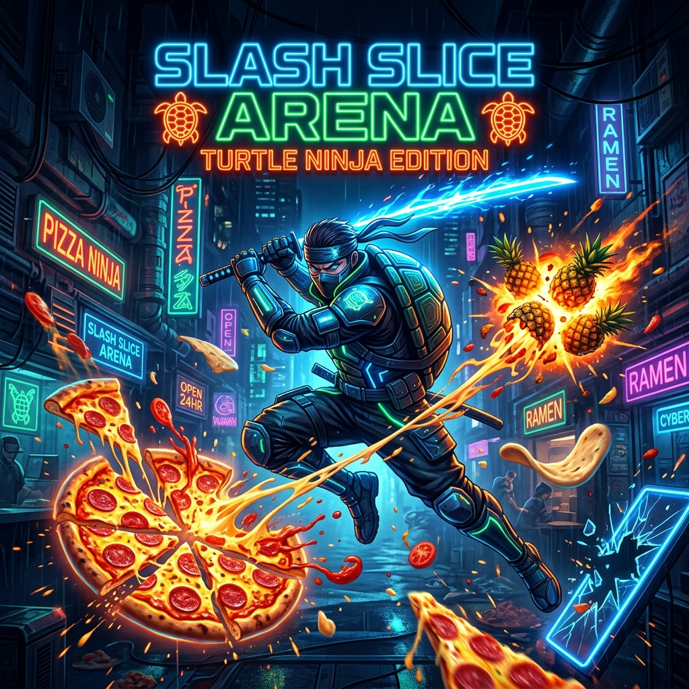

# 🍕 Slash Slice Arena — Turtle Ninja Edition



[](https://slashslice.spicycrust.com)
[](https://stellar.org)
[](https://privy.io)
[](https://mediapipe.dev)

**Slash Slice Arena** is a zero-friction, spatial arcade game running 100% in the browser. It combines **Edge AI Computer Vision** (MediaPipe Hands), a **60 FPS HTML5 Canvas Physics Engine**, **PartyKit Real-Time WebSockets**, and **Stellar/Soroban Gas Abstraction**.

Players assume the role of a Ninja Pizza Chef, using their own hands in front of their webcam to slice flying ingredients in mid-air—delivering classic arcade thrill backed by immutable, gas-free blockchain leaderboard records.

👉 **Live Demo:** [https://slashslice.spicycrust.com](https://slashslice.spicycrust.com)

---

## 📚 Technical Documentation Suite

For deep-dive architectural breakdowns, smart contract specifications, and development manuals, explore our comprehensive documentation modules:

| Document | Description |
| :--- | :--- |
| 🏗️ [**System Architecture & Topology**](docs/ARCHITECTURE.md) | Component diagrams, RAF 60FPS loop, React/Canvas separation, and PartyKit WebSocket rooms. |
| ⚡ [**Web3, Stellar & Soroban**](docs/WEB3_SOROBAN_STELLAR.md) | Deterministic keypair derivation (`Ed25519`), server-side Gas Abstraction (`FeeBumpTransaction`), and Vercel KV Redis persistence. |
| 👁️ [**Vision Engine & Physics**](docs/VISION_GAME_PHYSICS.md) | MediaPipe 21 3D landmarks tracking, swipe velocity thresholds, particle engine physics, and WebAudio synthesizer. |
| 🛠️ [**Development & Deployment**](docs/DEVELOPMENT_DEPLOYMENT.md) | Local setup, HTTP vs HTTPS secure context polyfills, environment variables reference, and Vercel deployment pipeline. |
| 🌐 [**OpenAPI 3.0 REST API Reference**](docs/API_REFERENCE.md) | OpenAPI specs, endpoints (`/api/score`, `/api/mint`), JSON schemas, cURL examples, HTTP status codes, and rate limiting. |

---

## 🚀 Key Technological Pillars

### 1. Real-Time Spatial Tracking (Edge AI)
- **MediaPipe Hands (Google)**: Runs WebAssembly/TFLite models client-side to track 21 3D hand keypoints at 60 FPS without sending video feeds to external servers.
- **2D Collision Physics**: Uses Landmark 8 (Index Finger Tip) as a virtual sword point, calculating continuous spatial line-segment intersections against moving target hitboxes.

### 2. Zero-Friction Web3 (Stellar & Soroban)
- **Social Onboarding (Privy)**: Log in via 1-click Google or Email authentication.
- **Deterministic Keypairs**: Computes a SHA-256 seed from the user's Privy DID to derive a native Stellar Ed25519 keypair (`G...`) in client memory. No seed phrases or extension downloads required.
- **Gas Abstraction**: Serverless backend wraps transaction payloads in Stellar `FeeBumpTransaction` wrappers, paying network gas fees so players experience zero-cost score submissions.

### 3. AAA Frontend Experience
- **React 18 & TypeScript**: Strict type safety and predictable state management.
- **HTML5 Canvas 2D Engine**: High-performance particle simulation (crust, sauce, cheese), screen shake effects, and procedural WebAudio FX without external audio assets.

---

## 🎮 Game Modes

- **Classic Mode**: 3 Lives. Pineapple bombs deduct 1 life.
- **Arcade Mode**: 60-second time trial. Pineapple bombs deduct 3 seconds. Slice pizza combos for bonus time multipliers.

### 🕹️ Control Methods
- **🖱️ / 📱 Touch & Mouse Mode**: Ultra-responsive zero-latency slicing on smartphones, tablets, and desktops with multi-touch support.
- **📷 Camera AI Mode**: Spatial slicing via MediaPipe hand tracking at 60 FPS directly through your webcam.

---

## 🧪 Automated Testing Suite

The project includes an enterprise-grade automated test harness featuring **219+ end-to-end and regression tests** across 5 tiers:

```bash
# Run the complete test suite
npm test
```

- **Tier 1**: Feature coverage, game lifecycle, and score calculation.
- **Tier 2**: Boundary conditions and multi-touch coordinates.
- **Tier 3**: Cross-feature interactions and state sanitization.
- **Tier 4**: Real-world smartphone viewports and device orientation shifts.
- **Tier 5**: Adversarial stress testing, WebRTC track teardown, and memory leak prevention.

---

## 💻 Quickstart (Local Development)

```bash
# 1. Clone the repository
git clone https://github.com/CaBsCrypto/pizzaninja.git
cd pizzaninja

# 2. Install dependencies
npm install

# 3. Run automated tests
npm test

# 4. Start the dev server (Localhost Port 3000)
npm run dev

# 5. Build for production
npm run build
```

Open `http://localhost:3000` in your browser.

---

## 📄 License & Credits

Built for the **PizzaDAO Season Hackathon**. Hosted on Vercel.
