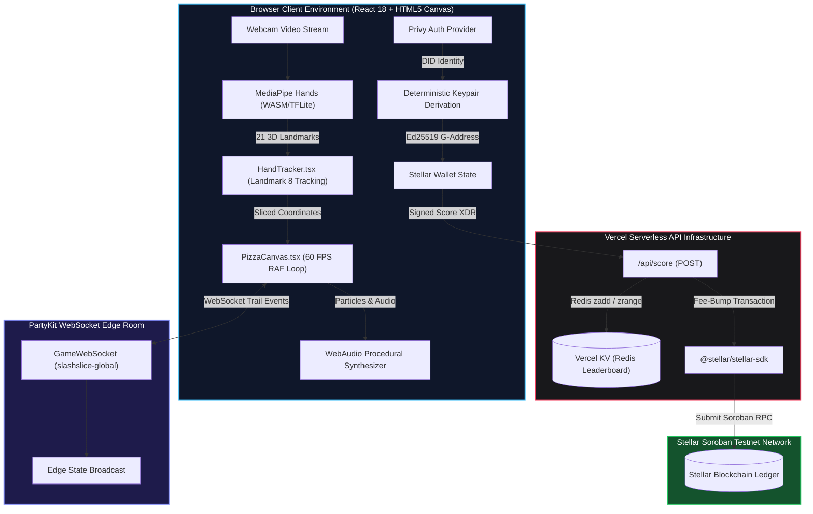

# 🏗️ Slash Slice Arena — System Architecture & Topology

## 📋 Executive Summary

**Slash Slice Arena** is a spatial web-based action game built for zero-friction Web3 gaming. It combines **Edge AI Computer Vision** (MediaPipe Hands), a **60 FPS HTML5 Canvas Physics Engine**, **PartyKit Real-Time WebSockets**, and **Stellar/Soroban Gas Abstraction**.

The application operates as a Client-First Web App with Serverless Microservices:
1. **Client Layer (Browser):** Processes video frames locally via WebAssembly/WebGPU, runs the physics & particle rendering loop, and executes client-side Web3 key derivation.
2. **State & Real-Time Sync (PartyKit):** Low-latency WebSocket edge server managing global rooms and player multiplayer states.
3. **Transaction & Persistence Layer (Vercel Serverless + Vercel KV):** Manages gas sponsorship (Fee-Bumping) on Stellar Testnet, persists high scores in Redis, and enforces rate limits.

---

## 📐 System Topology & Component Diagram

The following diagram illustrates the complete data flow from physical hand movement in front of the user's camera to on-chain ledger commitment on Stellar:



---

## ⏱️ Core Frame Execution & Physics Loop

The game loop is decoupled from React's state reconciliation cycle to guarantee a solid **60 FPS** performance budget on low-end mobile devices and tablets.

### React vs. Canvas Render Loop Architecture

```
┌─────────────────────────────────────────────────────────────────────────────┐
│ React Application Context (App.tsx / StellarHub.tsx)                        │
│ ├── Holds UI state: isPlaying, mode, score, highscore, walletState          │
│ └── Triggers React re-renders ONLY on Game Over / Menu state changes        │
└──────────────────────────────────────┬──────────────────────────────────────┘
                                       │ (Passes refs & callbacks)
┌──────────────────────────────────────▼──────────────────────────────────────┐
│ PizzaCanvas Component (RequestAnimationFrame Loop)                          │
│ ├── Reads raw mutable state from stateRef.current (0 React re-renders)       │
│ ├── Updates entity positions (pizzas, bombs, particles, combo popups)       │
│ ├── Performs continuous line-segment intersection checks (Slash detection)   │
│ ├── Renders off-screen buffers & applies canvas transformations              │
│ └── Emits audio triggers directly to WebAudio API                           │
└─────────────────────────────────────────────────────────────────────────────┘
```

### Frame Budget Breakdown (16.6 ms per frame at 60 FPS)

| Phase | Duration | Description |
| :--- | :--- | :--- |
| **MediaPipe Inference** | ~4 - 6 ms | Runs asynchronously in WebAssembly worker. Interpolates 21 3D hand keypoints. |
| **Physics & Collision** | ~1 - 2 ms | Sweeps slash vectors against target hitboxes using point-to-segment distance formulas. |
| **Particle Simulation**| ~1 - 3 ms | Calculates velocity, gravity, decay, and rotation for crust, sauce, and cheese fragments. |
| **Canvas Draw Calls** | ~3 - 5 ms | Draws backgrounds, pizza slices, glowing trails, shadow blurs, and vector text elements. |
| **Idle / Buffer** | ~2 - 5 ms | Headroom allocated to prevent frame drops during screen-shake and intense combo explosions. |

---

## 🌐 Real-Time Synchronization (PartyKit WebSockets)

Multiplayer room tracking and slice trails are handled via a lightweight **PartyKit Edge Server** (`party/server.ts`).

### Connection Lifecycle & Protocol

1. **Initialization**: On component mount, `GameWebSocket` singleton establishes a connection to `wss://[host]/parties/main/slashslice-global`.
2. **Offline Fallback & Graceful Degradation**: If the WebSocket backend is unavailable, the client throttles warning logs (`hasWarnedOffline` flag) and operates seamlessly in Single-Player Offline Mode without throwing uncaught exceptions.
3. **Message Types**:
   - `slash`: Broadcasts high-speed trail vectors across all active players in the room.
   - `score_update`: Syncs live competitive standings.

---

## 🛡️ Exception Boundary & Resilience Design

The client is protected by an explicit React `ErrorBoundary` wrapper (`src/components/ErrorBoundary.tsx`) targeting critical regions:
- **Root Level Boundary**: Surrounds `PrivyProvider` and `App` to capture third-party SDK failures.
- **Canvas Fallback UI**: Gracefully renders a crash recovery screen if WebGL or Canvas context creation fails.
- **Secure Context Fallback**: Automatic `window.isSecureContext` polyfill in `src/main.tsx` ensures local HTTP testing (`http://192.168.1.17:3000`) does not trigger fatal WebCrypto crashes.
