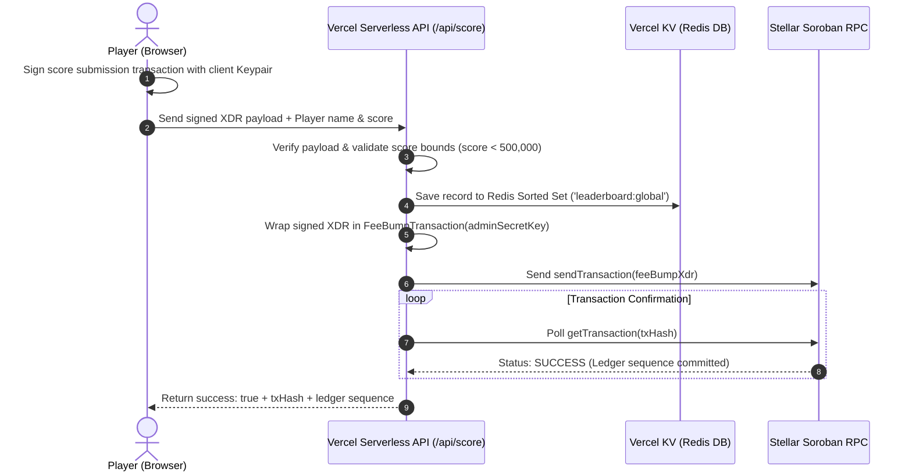

# ⚡ Web3, Stellar & Soroban Smart Contract Integration

## 📋 Executive Summary

**Slash Slice Arena** implements an **Invisible Web3 Onboarding Engine**. Traditional Web3 games force players to download browser extensions (e.g., MetaMask, Freighter), manage 24-word seed phrases, and buy crypto for network gas fees before they can play.

Slash Slice Arena eliminates 100% of these barriers through two core cryptographic patterns:
1. **Deterministic Ed25519 Keypair Derivation**: Uses Web2 Social Logins (Google, Email) to securely derive a native Stellar keypair on the client.
2. **Gas Abstraction (Fee-Bumping)**: A serverless backend sponsors 100% of network fees using Stellar's native Fee-Bump transaction wrapper (`FeeBumpTransaction`), enabling players to write scores and mint Soroban NFTs with **Zero Gas Fees**.

---

## 🔑 Deterministic Keypair Derivation (Privy + Stellar)

Privy is utilized strictly as a **Web2 Identity Provider (IdP)**. When a user authenticates via Google or Email, Privy guarantees an immutable, unique Decentralized Identifier (e.g., `did:privy:cmqdk...`).

The client computes a deterministic 256-bit seed using browser-native WebCrypto APIs:

$$\text{Seed} = \text{SHA-256}(\text{user.id} + \text{"\_spicycrust\_privy\_shared\_salt\_2026"})$$

```typescript
// Client-side key derivation logic in StellarHub.tsx
const encoder = new TextEncoder();
const salt = "_spicycrust_privy_shared_salt_2026";
const data = encoder.encode(user.id + salt);

// Generate 32-byte cryptographic digest
const hashBuffer = await crypto.subtle.digest('SHA-256', data);
const hashArray = new Uint8Array(hashBuffer);

// Construct native Stellar Ed25519 Keypair
const keypair = Keypair.fromRawEd25519Seed(Buffer.from(hashArray));
const stellarPublicKey = keypair.publicKey(); // Output: G... (56 chars)
```

### Keypair Advantages

| Feature | Standard Web3 Wallet | Slash Slice Deterministic Keypair |
| :--- | :--- | :--- |
| **Onboarding Time** | ~5-10 minutes | ~3 seconds (1-click Google auth) |
| **Seed Phrase Management** | Manual backup required | Automatically recovered on Google re-login |
| **Chain Compatibility** | Native Stellar / Soroban | Native Stellar / Soroban (`G...` format) |
| **Non-Custodial Guarantee** | Client-managed | Client-derived in RAM; private keys never hit servers |

---

## ⛽ Gas Abstraction & Server-Side Fee-Bumping

In Stellar's Soroban smart contract environment, executing contract calls requires network gas paid in `XLM`. To make the game 100% free-to-play, Slash Slice Arena uses **Stellar Fee-Bump Transactions**.



### Code Implementation (`api/score.ts`)

```typescript
// 1. Reconstruct user transaction from signed XDR
const userTx = TransactionBuilder.fromXDR(signedXdr, Networks.TESTNET);

// 2. Wrap user transaction in a FeeBumpTransaction paid by server admin account
const feeBumpTx = TransactionBuilder.buildFeeBumpTransaction(
  adminKeypair,
  (parseInt(userTx.fee) + 500000).toString(), // Cover base fee + Soroban resources
  userTx,
  Networks.TESTNET
);

// 3. Sign FeeBump wrapper with Server Admin Secret Key
feeBumpTx.sign(adminKeypair);

// 4. Submit to Stellar Testnet RPC
const response = await rpcServer.sendTransaction(feeBumpTx);
```

---

## 🏆 Data Persistence & Leaderboard Strategy

Scores and game replays are managed through a dual-storage model:

1. **Primary On-Chain Record (Soroban Ledger)**: Immutable score proof linked to the player's public key.
2. **Global Leaderboard (Vercel KV / Redis)**: High-speed sorted set (`leaderboard:global`) for real-time rank queries (`zrevrangebyscore`).
3. **Resilience Fallback (Browser LocalStorage)**: If network connectivity or Vercel KV is offline, score records are queued locally under `slashslice_local_leaderboard` so players never lose their achievements.

---

## 🔄 Web3 Transaction Visual Stepper UI

During score immortalization, the UI presents a **3-Step Visual Stepper Modal** (`App.tsx`) to clearly communicate the underlying Web3 mechanics to non-crypto players:

```
┌────────────────────────────────────────────────────────────────────────────┐
│ ⚡ IMMORTALIZING RECORD ON STELLAR                                         │
├────────────────────────────────────────────────────────────────────────────┤
│ [✓] Step 1: Digital Signature                                             │
│     Generating Ed25519 cryptographic signature from Vault                 │
│                                                                            │
│ [🔄] Step 2: Gas Sponsorship (In Progress)                                  │
│     Server Abstracting Gas Fees — Sponsoring XLM transaction              │
│                                                                            │
│ [ ] Step 3: Soroban Ledger Write                                           │
│     Committing block sequence to Stellar Blockchain Testnet                │
└────────────────────────────────────────────────────────────────────────────┘
```
